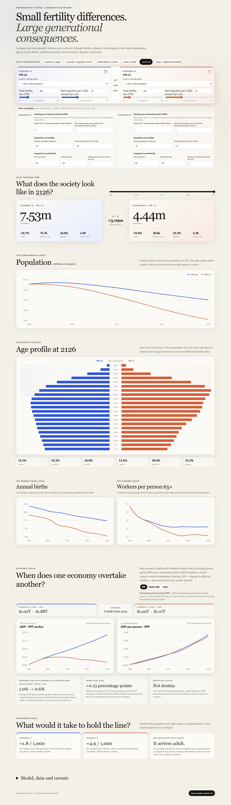
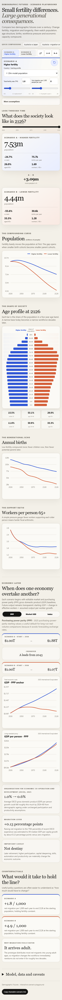

# Demographic Futures

Demographic Futures is an interactive scenario playground for exploring how fertility, migration, longevity, retirement age, and productivity assumptions can shape population and economic capacity over 100 years. It is intended for curious readers, educators, and policy or research teams who want to compare assumptions and understand how their effects compound. It is an exploratory model, not an official forecast or policy recommendation.



<details>
<summary>View the full mobile layout</summary>


</details>

## Try it locally

Requires Node.js 20 or newer.

```bash
npm install
npm run dev
```

Open the local URL printed by Vite. To check the production build locally:

```bash
npm run build
npm run preview
```

## Deploy to Vercel

The app is a static Vite site. Import this repository into Vercel and deploy with:

- Build command: `npm run build`
- Output directory: `dist`

The included `vercel.json` sets these values for the project. The app has no server or environment-variable requirements; its scenario sharing uses the URL hash.

## Use the playground

- Choose a starting country or synthetic profile for Scenario A and B, or start from a quick comparison.
- Quick comparisons include Australia and Japan, Australia with migration on or off, the United States and China, China and India, a fertility-only comparison, and Japan at current or replacement fertility.
- Adjust the total fertility rate and annual net migration with each scenario’s controls. Open **More assumptions** to edit starting population, the total fertility rate in 2100, life expectancy, retirement age, output-per-worker growth, and gross domestic product (GDP) baselines.
- GDP inputs are totals in trillions: market values use United States dollars (USD), while purchasing power parity (PPP) values use international dollars. They stay independent when population changes. Selecting a country loads all of its starting assumptions. The round reset button at the upper-right of a scenario restores that entire scenario to the selected country’s defaults.
- Numeric controls accept values beyond the usual slider ranges, including retirement ages such as 50 or 100. GDP and population must be positive, fertility and life expectancy must be above zero, and annual productivity growth cannot be below -100% because it compounds year over year.
- Use the year slider to inspect outcomes at any point from 2026 to 2126. The economic view compares purchasing power parity, market United States dollars, or a normalized index.
- Swap or copy scenarios, then use **Copy shareable scenario link** to share the current assumptions, selected year, and economic view.

## What the model does

The demographic projection advances 101 one-year age cohorts annually. Births use an age-specific fertility curve scaled to the selected total fertility rate (TFR); survival is calibrated to the life-expectancy input; net migration is distributed using a young-adult-heavy age profile. Fertility can stay at its current value or move linearly to the selected 2100 value, after which it remains constant. Migration is held at a constant rate per 1,000 people per year.

The economic projection starts from each scenario’s market and purchasing power parity (PPP) gross domestic product (GDP) totals and applies the change in estimated effective workers and the assumed annual output-per-worker growth. Effective workers use a generic participation schedule that shifts at the selected retirement age. The market United States dollar (USD) view holds relative exchange-rate and price relationships constant; it does not forecast future exchange rates. GDP per person is a model proxy, not a living-standards forecast.

The 22 country presets use indicators derived from the United Nations World Population Prospects (UN WPP) 2024 and World Bank World Development Indicators (WDI), with source links in the app. Most starting age profiles are generated to match broad dependency ratios rather than using complete single-year age data. Australia and Japan use more detailed starting profiles. Country values are rounded inputs and presets are starting points, not official country forecasts. The synthetic 10-million-person profile uses illustrative $1 trillion market and PPP baselines.

## Checks and screenshot

```bash
npm test
npm run build
npx playwright install chromium
npm run test:e2e
```

The browser checks cover the mobile layout and the full-page README screenshot. Regenerate that screenshot after UI changes with:

```bash
npm run build
npm run capture:screenshot
```

The screenshot is saved to `docs/dashboard-full.png`.
